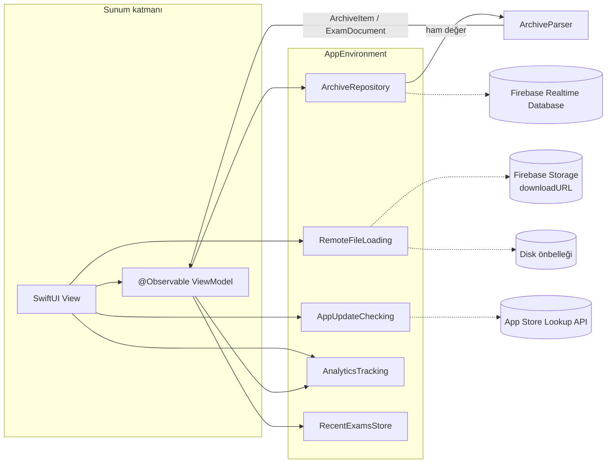

<div align="center">


# ViFi — Sınav Arşivi

Üniversitelerin geçmiş sınavlarına hızlıca ulaşmanı sağlayan iOS uygulaması.


</div>

---

## İçindekiler

- [Hakkında](#hakkında)
- [Özellikler](#özellikler)
- [Ekran Görüntüleri](#ekran-görüntüleri)
- [Mimari](#mimari)
- [Klasör Yapısı](#klasör-yapısı)
- [Gereksinimler](#gereksinimler)
- [Kurulum](#kurulum)
- [Örnek Veriyle Çalıştırma](#örnek-veriyle-çalıştırma)
- [Testler ve Kod Kalitesi](#testler-ve-kod-kalitesi)
- [Firebase Güvenlik Kuralları](#firebase-güvenlik-kuralları)
- [Geliştirici Rehberi](#geliştirici-rehberi)
- [Sürüm Notları](#sürüm-notları)
- [Bilinen Durumlar](#bilinen-durumlar)

## Hakkında

**ViFi**, öğrencilerin üniversitelerine ait geçmiş dönem sınavlarını tek bir yerden bulup incelemesi için
geliştirilmiş bir sınav arşividir. Arşiv beş seviyeden oluşur:

```
Üniversite › Fakülte › Bölüm › Ders › Sınav
```

Her sınav ya sayfa sayfa görsellerden (JPG) ya da bir PDF belgesinden oluşur. Arşiv Firebase Realtime Database'te,
sınav dosyaları ise Firebase Storage'da tutulur.

## Özellikler

| Özellik | Açıklama |
|---|---|
| **Hiyerarşik gezinme** | Üniversiteden sınava kadar tek bir gezinme yığını; üstteki içerik yolu (breadcrumb) ile herhangi bir üst seviyeye tek dokunuşla dön. |
| **Arama** | Her listede Türkçe karakter ve büyük/küçük harf duyarsız arama (`ı/i`, `ş/s`, `ğ/g`…). |
| **Son görüntülenenler** | Ana sayfada son açılan sınavlar; tek dokunuşla tekrar aç, listeden kaldır ya da tümünü temizle. |
| **Görsel sınav görüntüleyici** | Sayfa kartları, tam ekran sayfalayıcı, 1–5x yakınlaştırma, çift dokunarak yakınlaştır/sıfırla. |
| **Uygulama içi PDF** | PDFKit ile sürekli kaydırma, sayfa göstergesi ve birden fazla dosya arasında geçiş. |
| **Paylaşım** | Sınavın tamamını ya da tek bir sayfayı dosya olarak paylaş. |
| **Çevrimdışı önbellek** | Açılan sınav dosyaları cihazda saklanır; daha önce açılan sınavlar tekrar indirilmeden açılır. |
| **Karanlık mod** | Tüm ekranlar sistem renkleriyle açık ve koyu temaya uyum sağlar. |
| **Erişilebilirlik** | Dynamic Type, VoiceOver etiketleri ve iPad'de okunabilir satır genişlikleri. |
| **Telefonla giriş** | Uygulamanın tamamı telefon numarasıyla (SMS kodu, yalnızca +90) girişi gerektirir; kod son hane girilince otomatik gönderilir, tekrar gönderme 60 sn bekletilir. |
| **Hesap** | Ana sayfadaki kişi simgesinden numaranı gör, çıkış yap ya da hesabını kalıcı olarak sil. |
| **Güncelleme bildirimi** | App Store'da yeni sürüm olduğunda kullanıcı nazikçe bilgilendirilir. |
| **Gizlilik** | Reklam yok, reklam kimliği (IDFA) yok, takip izni istenmez. |

## Ekran Görüntüleri

<!--
Ekran görüntülerini örnek veriyle (-ViFiMockData) alıp docs/screenshots/ altına ekleyin ve aşağıdaki
tabloyu  biçimindeki etiketlerle güncelleyin.
Açık ve koyu tema için ayrı görüntüler önerilir.
-->

| Ana Sayfa | Gezinme | Görsel Sınav | PDF |
|:---:|:---:|:---:|:---:|
| _yakında_ | _yakında_ | _yakında_ | _yakında_ |

## Mimari

ViFi; **SwiftUI**, **MVVM** ve **Observation** çatısı üzerine kurulu, Swift 6 katı eşzamanlılık
(strict concurrency) modunda derlenen bir uygulamadır.



### Temel kararlar

- **SwiftUI + MVVM + Observation.** Ekran durumları `@Observable` view model'lerde tutulur ve view tarafından
  `@State` ile sahiplenilir. Combine ve `ObservableObject` kullanılmaz; asenkron işler `async/await` ile yürür.
- **Swift 6 ve MainActor varsayılanı.** Proje `SWIFT_DEFAULT_ACTOR_ISOLATION = MainActor` ile derlenir; görsel
  çözme, dosya ve JSON işlemleri gibi ağır işler `nonisolated` fonksiyonlarla ana iş parçacığının dışında yapılır.
- **Protokol arkasındaki servisler.** Veri katmanı `ArchiveRepository`, `RemoteFileLoading`, `AppUpdateChecking`,
  `AnalyticsTracking`, `AuthServicing` ve `RequestAuthorizing` protokolleri üzerinden kullanılır. Böylece Firebase, App Store ve ağ erişimi testlerde ve
  önizlemelerde örnek implementasyonlarla değiştirilebilir.

  | Protokol | Canlı implementasyon | Örnek (DEBUG) implementasyon |
  |---|---|---|
  | `ArchiveRepository` | `FirebaseArchiveRepository` | `MockArchiveRepository` |
  | `RemoteFileLoading` | `RemoteFileLoader` | `RemoteFileLoader` (paket içi örnek dosyalar) |
  | `AppUpdateChecking` | `AppStoreUpdateChecker` | `StubUpdateChecker` |
  | `AnalyticsTracking` | `FirebaseAnalyticsTracker` | `NoOpAnalyticsTracker` |
  | `AuthServicing` | `FirebaseAuthService` | `MockAuthService` (kod: `111111`) |
  | `RequestAuthorizing` | `FirebaseRequestAuthorizer` | — (örnek dosyalar `file://`, yetki gerekmez) |

- **Giriş zorunlu.** Uygulamanın tamamı telefon numarasıyla (SMS kodu, yalnızca +90) giriş gerektirir. `SessionStore`
  oturum durumunu (`unknown` / `signedOut` / `signedIn`) tutar; `RootView` buna göre `LoginView` ya da arşivi
  gösterir. Hesap ekranı (`AccountView`) çıkış ve kalıcı hesap silme sunar. `AppDelegate`, APNs belirtecini ve
  sessiz bildirimleri Firebase Auth'a iletir (swizzling kapalı); reCAPTCHA dönüşü `onOpenURL` ile iletilir.
- **App Check.** `live()` Firebase'i yapılandırmadan önce App Check sağlayıcısını kurar: Release'te App Attest
  (desteklenmeyen cihazda DeviceCheck), Debug ve simülatörde debug sağlayıcısı.
- **Yetkili dosya indirme.** Storage dosyaları `downloadURL` içindeki `token=` parametresiyle değil, kullanıcının
  ID belirteci (`Authorization: Firebase …`) ve App Check belirteci (`X-Firebase-AppCheck`) ile indirilir. Önbellek
  anahtarı `token` parametresi çıkarılmış kanonik URL'dir.

- **AppEnvironment ile bağımlılık enjeksiyonu.** Tüm servisler tek bir `AppEnvironment` nesnesinde toplanır ve
  `.environment(_:)` ile view hiyerarşisine verilir. `live()` üretim servislerini, `mock()` örnek veriyi kurar;
  `makeDefault()` başlatma argümanına göre ikisinden birini seçer. Ortam `AppDelegate` tarafından ilk erişimde (`didFinishLaunching` içinde) kurulur; Firebase Auth'un APNs yöneticileri `UIApplication` varken oluşsun diye bu sıra önemlidir.
- **Router.** Gezinme durumu `NavigationStack` yolunu tutan `@Observable Router` nesnesindedir. `Route` enum'u
  (`browse`, `exam`) tüm hedefleri tanımlar; breadcrumb'a dokunmak `popTo(_:)`, son görüntülenen bir sınavı açmak
  ise `openExam(at:kind:)` ile tüm üst seviyeleri yığına yerleştirir, böylece Geri tuşu arşivde yukarı yürür.
- **ArchiveParser.** Realtime Database'ten gelen ham değerleri modellere çeviren, Firebase'e bağımlı olmayan saf bir
  katmandır. İsim yer tutucularını (`uniname`, `fakname`…) atlar, dizi biçimindeki düğümleri normalize eder ve
  listeleri Türkçe harf sıralaması ile sayı farkındalıklı sıralar (sınavlar en yeniden eskiye).
- **Çevrimdışı önbellek.** `RemoteFileLoader` dosyaları geniş bir `URLCache` ve `Caches/ExamFiles` altındaki disk
  önbelleği ile indirir; görseller ekran boyutuna göre küçültülerek çözülür.
- **Durum ve günlük.** Ekran içerikleri `Loadable` (`loading` / `loaded` / `failed`) ile modellenir; hatalar
  `ArchiveError` üzerinden kullanıcıya Türkçe mesajlarla gösterilir. Günlükler `print` yerine OSLog
  (`Logger.archive`, `Logger.files`, `Logger.app`) ile yazılır.

### Veritabanı yapısı

```
Universitiess/<üniversite>/<fakülte>/<bölüm>/<ders>/<sınav>/<JPG|PDF>/<pushId>/downloadURL
```

Her düğüm kendi adını da metin değeri olarak saklar (`uniname`, `fakname`, `bolname`, `lessonname`, `imagename`);
gerçek arşiv düğümleri her zaman nesne olduğundan bu yaprak değerler listelenmez.

## Klasör Yapısı

```
ViFi-iOS/
├── project.yml              # XcodeGen tanımı — Xcode projesinin tek kaynağı
├── .swiftlint.yml           # Lint kuralları
├── firebase/                # Güvenlik kuralları, kural testleri, belirteç iptal betiği (bkz. firebase/README.md)
├── ViFi/
│   ├── App/                 # Uygulama girişi, AppDelegate, RootView, Router, AppEnvironment
│   ├── Core/
│   │   ├── Models/          # ArchivePath, ArchiveItem, ExamDocument, PhoneNumber
│   │   ├── Services/        # Servis protokolleri, ArchiveParser, Firebase / App Store servisleri, AuthServicing, SessionStore, App Check, RecentExamsStore
│   │   └── Utilities/       # Loadable, Logger
│   ├── DesignSystem/        # IconBadge, durum görünümleri, seviye stilleri
│   ├── Features/
│   │   ├── Auth/            # Telefon numarasıyla giriş (SMS kodu)
│   │   ├── Account/         # Hesap: çıkış ve hesap silme
│   │   ├── Home/            # Ana sayfa, son görüntülenenler, Hakkında
│   │   ├── Browse/          # Fakülte → sınav listeleri, breadcrumb
│   │   └── Exam/            # Görsel ve PDF sınav görüntüleyicileri
│   ├── Resources/           # Assets, Info.plist, GoogleService-Info.plist
│   └── Preview Content/     # Önizleme ve örnek veri dosyaları (yalnızca geliştirme)
├── ViFiTests/               # Birim testleri
└── ViFiUITests/             # Arayüz testleri (örnek veriyle çalışır)
```

> **Not:** 2.x sürümünün UIKit/Storyboard kaynakları, `Podfile` ve `ViFi.xcworkspace` 3.0 ile kaldırıldı; git
> geçmişinde duruyorlar. Projeyi her zaman `ViFi.xcodeproj` ile açın, `pod install` çalıştırmayın.

## Gereksinimler

| Araç | Sürüm |
|---|---|
| Xcode | 26 veya üzeri |
| iOS / iPadOS | 17.0 veya üzeri |
| [XcodeGen](https://github.com/yonaskolb/XcodeGen) | 2.42 veya üzeri |
| [SwiftLint](https://github.com/realm/SwiftLint) | Önerilir (derleme sırasında çalışır) |

Bağımlılıklar Swift Package Manager ile yönetilir: Firebase iOS SDK 12 (`FirebaseDatabase`,
`FirebaseAnalyticsCore`, `FirebaseAuth`, `FirebaseAppCheck`). CocoaPods kullanılmaz. Paket sürümleri depodaki `Package.resolved` ile sabitlenir
(Firebase 12.19.2); güncellemek için Xcode'da *File › Packages › Update to Latest Package Versions*.

## Kurulum

```bash
# 1. Araçları kur
brew install xcodegen swiftlint

# 2. Depoyu klonla
git clone https://github.com/emrebuyuker/ViFiIos.git ViFi-iOS
cd ViFi-iOS

# 3. Xcode projesini üret
xcodegen generate

# 4. Projeyi aç (paketler ilk açılışta çözülür)
open ViFi.xcodeproj
```

- **Proje dosyası üretilir.** `ViFi.xcodeproj` XcodeGen tarafından `project.yml`'dan oluşturulur ve depoda tutulmaz
  (yalnızca SwiftPM kilit dosyası `Package.resolved` saklanır). Hedef, ayar ya da bağımlılık değişikliklerini
  `project.yml` üzerinde yapıp `xcodegen generate` komutunu tekrar çalıştırın.
- **GoogleService-Info.plist.** Canlı Firebase yapılandırması `ViFi/Resources/GoogleService-Info.plist` dosyasındadır.
  Kendi Firebase projenizle çalışacaksanız bu dosyayı kendi projenizin dosyasıyla değiştirin. Örnek veri modu
  Firebase'e hiç bağlanmaz ve bu dosyaya ihtiyaç duymaz.
- **Firebase Konsolu (proje sahibi yapar).**
  - *Authentication › Sign-in method*: **Phone** sağlayıcısını etkinleştirin. *Settings › SMS region policy*
    altında yalnızca Türkiye (TR) için izin listesi tanımlayın.
  - *Authentication › Phone*: geliştirme ve App Review için sahte test numaraları ekleyin (biçim `+90 5XX XXX XX XX`,
    kod `111111`). Debug'da `-ViFiPhoneAuthTesting` ile bu numaralarda uygulama doğrulaması atlanır. Depo herkese
    açık olduğundan gerçek test numaralarını hiçbir dosyaya yazmayın; bu numaralarla herkes SMS'siz giriş yapabilir.
  - *Project settings › Cloud Messaging*: Apple'dan APNs Auth Key (`.p8`) oluşturup Key ID ve Team ID ile yükleyin.
    Sessiz bildirimle doğrulama buna dayanır; yoksa giriş her zaman reCAPTCHA'ya düşer.
  - *App Check › Apps*: iOS uygulamasını **App Attest** sağlayıcısıyla kaydedin (yedek olarak DeviceCheck).
    Debug derlemesini ya da simülatörü bir kez çalıştırıp Xcode konsolundaki *Firebase App Check debug token*
    değerini *Manage debug tokens* altına ekleyin (CI için `FIRAAppCheckDebugToken`).
  - *App Check › APIs*: Realtime Database ve Storage için zorunlu kılmayı yalnızca yeni sürüm yayınlandıktan ve
    debug belirteçleri eklendikten sonra açın.
- **Apple Developer.** `com.BuyukerYazilim.ViFi2` kimliğinde **Push Notifications** ve **App Attest**
  yeteneklerini etkinleştirip provisioning profillerini yenileyin (`ViFi.entitlements` bunları gerektirir).
  App Store Connect gizlilik etiketlerine *Telefon Numarası* ve *Kullanıcı Kimliği* ekleyin.
- **İmzalama.** Simülatör derlemeleri imza gerektirmez. Gerçek cihazda çalıştırmak için `project.yml` içindeki
  `DEVELOPMENT_TEAM` ve provisioning profili ayarlarını kendi hesabınıza göre güncelleyin.

## Örnek Veriyle Çalıştırma

Uygulama, Firebase'e ve ağa hiç dokunmadan paket içindeki örnek arşivle çalışabilir. Bu mod UI testleri, demolar ve
Firebase erişimi olmayan geliştirme ortamları içindir ve yalnızca **Debug** derlemelerinde bulunur.

**Xcode'da:** *Product › Scheme › Edit Scheme… › Run › Arguments* altında *Arguments Passed On Launch* listesine
`-ViFiMockData` ekleyin.

**Komut satırında:**

```bash
# Derle (çıktı ./build altına)
xcodebuild -project ViFi.xcodeproj -scheme ViFi \
  -destination 'platform=iOS Simulator,name=iPhone 17 Pro' -derivedDataPath build build

# Simülatörü aç (zaten açıksa hata verir; yok sayılabilir), uygulamayı kur ve örnek veriyle başlat
xcrun simctl boot 'iPhone 17 Pro'
xcrun simctl install booted build/Build/Products/Debug-iphonesimulator/ViFi.app
xcrun simctl launch booted com.BuyukerYazilim.ViFi2 -ViFiMockData
```

Örnek arşiv; görsel ve PDF sınavlar, uzun isimli bir üniversite, sınavı olmayan bir ders ve dosyası olmayan bir
sınav gibi uç durumları içerir. SwiftUI önizlemeleri de aynı veriyi `AppEnvironment.mock()` üzerinden kullanır.

Örnek veri modunda kullanıcı oturum açmış olarak başlar. Diğer Debug başlatma argümanları:

| Argüman | Etki |
|---|---|
| `-ViFiSignedOut` | `-ViFiMockData` ile birlikte: oturum kapalı başlar (giriş ekranı). Her numara kabul edilir, kod `111111`. |
| `-ViFiPhoneAuthTesting` | Canlı Firebase ile: telefon doğrulamasında uygulama doğrulamasını (APNs / reCAPTCHA) kapatır. Yalnızca Firebase konsolunda tanımlı test numaralarıyla çalışır. |

## Testler ve Kod Kalitesi

```bash
# Birim ve arayüz testleri (kod kapsamı açık)
xcodebuild test -project ViFi.xcodeproj -scheme ViFi \
  -destination 'platform=iOS Simulator,name=iPhone 17 Pro'

# Lint ve otomatik düzeltme
swiftlint lint
swiftlint --fix
```

- **ViFiTests** — `ArchiveParser`, view model'ler, sürüm karşılaştırması ve son görüntülenenler gibi iş mantığını
  ağdan bağımsız olarak doğrular.
- **ViFiUITests** — Uygulamayı `-ViFiMockData` ile başlatır ve ana akışları (gezinme, arama, sınav açma, son
  görüntülenenler) uçtan uca test eder. Testler erişilebilirlik kimliklerine (`home.list`, `row.<ad>`,
  `breadcrumb.<i>`, `exam.images`…) dayanır; bu kimlikler testlerle yapılan bir sözleşmedir, değiştirilmemelidir.
- **SwiftLint** her derlemede çalışır. `print` yerine `Logger`, Combine yerine Observation kullanımı gibi proje
  kuralları da lint ile denetlenir.

## Firebase Güvenlik Kuralları

Kurallar ve testleri `firebase/` klasöründedir (operasyon özeti: [firebase/README.md](firebase/README.md)).
Varsayılan her şey kapalıdır; aşağıdaki izinler dışında kimse hiçbir şeye erişemez.

| Yol | Kim ne yapabilir |
|---|---|
| Realtime DB `/Universitiess` | +90 telefonla girişli kullanıcılar ve yöneticiler okur; yalnızca yönetici yazar. |
| Realtime DB `/pendingExams/<uid>` | Kullanıcı yalnızca kendi kaydını okur; yeni gönderim oluşturur, kendi `pending` gönderimini siler, var olanı değiştiremez. Yönetici hepsini okur ve yazar. Alanlar sıkı doğrulanır. |
| Realtime DB diğer tüm düğümler | Kimseye açık değil (yönetici dahil). |
| Storage `imagess/`, `pdfs/` | Tek dosya okuma: +90 kullanıcı ve yönetici. Listeleme kimseye açık değil; yalnızca yönetici yazar. |
| Storage `pending/<uid>/<gönderim>/` | Yalnızca sahibi yeni JPEG/PDF (1 bayt – 15 MiB) yükler, üzerine yazamaz; sahibi ve yönetici okur ve siler. |

Yönetici, `admin: true` özel talebi (custom claim) taşıyan hesaptır: `setCustomUserClaims(uid, { admin: true })`.
Yükleme arayüzü henüz yoktur; kurallar şimdiden hazırdır.

**Emülatör testleri** (Firebase CLI ve Java 21 gerekir; proje kimliği `demo-vifi`, gerçek projeye dokunulmaz):

```bash
cd firebase
npm install
JAVA_HOME=/opt/homebrew/opt/openjdk@21 npm test
```

**Yayınlama** (yalnızca giriş ve App Check içeren sürüm hazır olduğunda; eski sürümler anında bozulur):

```bash
cd firebase
firebase deploy --only database,storage --project vifi-831a8 --account <sahip hesabı>
```

Yayından önce konsoldan gereksiz kök düğümleri (`poc`, `2DfjkeJxHJTkdhz5VNVwFJzAeuD`, `Announcements`) silin.

**İndirme belirteçlerini iptal etme.** Mevcut `downloadURL` bağlantılarındaki `token=` parametresi kuralları
atlar. Yeni sürüm yayınlandıktan sonra `firebase/scripts/revoke-download-tokens.mjs` ile iptal edin
(`gcloud auth application-default login` ile proje sahibi olarak):

```bash
cd firebase
node scripts/revoke-download-tokens.mjs backup  --out backups/tokens-<tarih>.json
node scripts/revoke-download-tokens.mjs revoke  --backup backups/tokens-<tarih>.json           # deneme, değişiklik yapmaz
node scripts/revoke-download-tokens.mjs revoke  --backup backups/tokens-<tarih>.json --apply
node scripts/revoke-download-tokens.mjs restore --from   backups/tokens-<tarih>.json --apply   # geri al
```

> [!NOTE]
> Uygulamanın kendi indirmeleri (`alt=media`, kimlik + App Check belirteciyle) yeni belirteç **üretmez**; bu,
> 10.10.2026'daki iptal öncesinde canlı bucket'ta tek dosyayla ölçüldü. Ancak okuma yetkisi olan bir kullanıcı
> `getMetadata`/`getDownloadURL` çağırarak belirteçsiz bir dosyaya yeni belirteç ürettirebilir ve kalıcı bir genel
> bağlantı elde edebilir; bu kurallarla engellenemez. Bu yüzden iptal, sızmış bağlantıları temizleyen tek seferlik
> bir işlemdir ve her çalıştırmadan önce yeni yedek gerekir. Yükleyen kullanıcılar da kendi `pending/` dosyaları
> için belirteç alabilir. Bunlar yalnızca kurallarla kapatılamaz; ileride Cloud Functions (belirteç temizliği, kota)
> gerekebilir. Onay aracı, incelenen dosyanın `generation`/`md5Hash` değerini sabitleyip yalnızca baytları kopyalamalıdır.

## Geliştirici Rehberi

Bu bölüm ViFi'ye yeni kod eklerken izlenecek adımları toplar. Claude ile çalışırken kökteki
[`CLAUDE.md`](CLAUDE.md) aynı kuralları özetler ve ek çalışma talimatları içerir. Her yeni dosyadan önce projede
aynı isimli bir dosya olmadığını kontrol edin.

### Yeni ekran eklemek

1. Dosyaları `ViFi/Features/<Özellik>/` altına koyun: `<Ad>View.swift` ve `<Ad>ViewModel.swift`.
2. **View model:** `@Observable final class <Ad>ViewModel`. Ekran durumu `Loadable<Value>` ile tutulur;
   bağımlılıklar protokol tipinde ve `@ObservationIgnored private let` olarak saklanır.
3. **View iki parçadır:** Dışarıdaki `struct <Ad>View`, bağımlılıkları `@Environment(AppEnvironment.self)` ile alır.
   İçerideki `private struct <Ad>Screen`, view model'i `@State` ile sahiplenir (`HomeView` / `HomeScreen` gibi).
   Yükleme, hata ve boş durumlar için `LoadingStateView`, `ErrorStateView` ve `EmptyStateView` kullanılır.
4. **Gezinme:** Yığına eklenen bir ekransa `Route`'a yeni bir case ekleyip `RootView.destination(for:)` içinde
   karşılayın. Modal ekranlar `.sheet` ile açılır (`AboutView`, `AccountView` gibi).
5. **Erişilebilirlik ve analitik:** Etkileşimli her öğeye `accessibilityIdentifier("<ekran>.<öğe>")` verin. Ekran
   görüntülemesini `environment.analytics.track(.screenView(name:))` ile bildirin.
6. **Önizleme ve test:** `#if DEBUG` içinde `AppEnvironment.mock()` kullanan bir `#Preview` ekleyin. View model için
   `ViFiTests/<Ad>ViewModelTests.swift` birim testini, kullanıcı akışı varsa UI testini yazın.

### Yeni servis eklemek

1. **Protokol:** `ViFi/Core/Services/ServiceProtocols.swift` içine (ya da `AuthServicing.swift` gibi kendi dosyasına)
   `AnyObject` protokolü olarak, `async` API ile tanımlayın. Kullanıcıya gösterilecek hatalar `ArchiveError`,
   `AuthError` ya da Türkçe `errorDescription` sağlayan yeni bir `LocalizedError` olmalıdır.
2. **Canlı implementasyon:** `ViFi/Core/Services/` altına ekleyin. Firebase kullanıyorsa yalnızca
   `AppEnvironment.live()` içinde oluşturun. Örnek veri modu Firebase'i hiç yapılandırmaz.
3. **Örnek ve test sürümleri:** Debug örneği `ViFi/Preview Content/MockServices.swift` (`#if DEBUG`), test double'ı
   `ViFiTests/TestDoubles.swift` içine eklenir.
4. **Bağlama:** `AppEnvironment`'a özellik ve `init` parametresi ekleyip `live()` ile `mock()`'u güncelleyin.
5. **Eşzamanlılık:** Ağır işler (JSON, görsel çözme, disk) `@concurrent nonisolated static` fonksiyonlarda yapılır.
   Ana iş parçacığına taşınan modeller `nonisolated` ve `Sendable` olur. Günlükler `Logger.archive`, `Logger.files`
   ya da `Logger.app` ile yazılır.

### Test yazmak

- **Birim testleri:** Swift Testing kullanılır (`import Testing`, `@Test`, `#expect`, `#require`); testler ağa
  çıkmaz. Hazır yardımcılar `TestDoubles.swift` içindedir: `StubArchiveRepository`, `StubAuthService`,
  `StubRequestAuthorizer`, `StubURLProtocol`, `AsyncGate`, `TestClock`, `TemporaryDefaults` ve `Fixture`.
- **Arayüz testleri:** Uygulamayı `-ViFiMockData` ile (giriş akışı için ek olarak `-ViFiSignedOut`) başlatır ve
  erişilebilirlik kimlikleriyle ilerler. Örnek modda doğrulama kodu `111111`'dir.
- **Kural testleri:** Her kural değişikliği için `firebase/tests/` altına hem izin verilen hem reddedilen durumu
  kapsayan test eklenir ve `cd firebase && npm test` ile çalıştırılır.

### Proje ayarı veya bağımlılık değiştirmek

Hedef, derleme ayarı, paket ve Info.plist değişiklikleri yalnızca `project.yml` üzerinden yapılır. Ardından
`xcodegen generate` çalıştırılır ve proje derlenir. `ViFi/Resources/Info.plist` üretilen bir dosyadır, elle
düzenlenmez. Entitlement değerleri `ViFi/Resources/ViFi.entitlements` dosyasında düzenlenir (yolu `project.yml`'de
`CODE_SIGN_ENTITLEMENTS` ile tanımlıdır). Paket sürümü değişirse `Package.resolved` commit'lenir.

### Firebase kuralı değiştirmek

1. `firebase/database.rules.json` veya `firebase/storage.rules` dosyasını düzenleyin.
2. Değişikliği kapsayan olumlu ve olumsuz testleri `firebase/tests/` altına ekleyin.
3. `cd firebase && npm test` ile emulator'de doğrulayın.
4. Proje sahibinin onayıyla yayınlayın (komut: [Firebase Güvenlik Kuralları](#firebase-güvenlik-kuralları)).
5. Uygulamayı simülatörde canlı veriyle deneyin: giriş, liste ve sınav açma.

### Sürüm öncesi kontrol listesi

- [ ] `project.yml` içinde `MARKETING_VERSION` ve `CURRENT_PROJECT_VERSION` güncellendi.
- [ ] Birim, arayüz ve kural testleri geçiyor; SwiftLint uyarısı yok.
- [ ] Apple Developer'da *Push Notifications* ve *App Attest* açık, provisioning profilleri yenilendi.
- [ ] Firebase'de APNs anahtarı yüklü, App Attest kayıtlı, App Check zorunlu.
- [ ] App Store Connect gizlilik etiketinde *Telefon Numarası* ve *Kullanıcı Kimliği* (Uygulama İşlevselliği) var.
- [ ] App Review notunda test numarası ve kodu verildi (numara depoya yazılmaz).
- [ ] [Sürüm Notları](#sürüm-notları) güncellendi.

### Commit kuralları

Başlık `[feat]`, `[fix]` ya da `[chore]` önekiyle kısa tutulur. Gerekirse boş bir satırdan sonra açıklama yazılır.
Test numaraları, debug token'ları, kişisel e-postalar, servis hesabı anahtarları ve `firebase/backups/` içeriği
commit'lenmez; depo herkese açıktır.

## Sürüm Notları

### 3.0.0

2.x sürümüne göre uygulama baştan yazıldı.

**Yeni**

- Karanlık mod desteği.
- Tüm listelerde Türkçe karakter duyarsız arama.
- Ana sayfada son görüntülenen sınavlar.
- PDF sınavlar artık Safari yerine uygulama içinde, PDFKit ile sayfa göstergesiyle açılıyor.
- Yakınlaştırma, çift dokunma ve sayfa paylaşımı destekleyen yeni tam ekran görüntüleyici.
- Sınavların tamamını dosya olarak paylaşma.
- Açılan sınavlar için çevrimdışı önbellek.
- Yeni sürüm bildirimi.
- Dynamic Type, VoiceOver ve iPad için iyileştirilmiş erişilebilirlik.
- Telefon numarasıyla giriş (SMS kodu, yalnızca +90) ve hesap ekranı: çıkış yapma, hesabı silme.
- Firebase App Check (App Attest) ve sıkılaştırılmış Realtime Database / Storage güvenlik kuralları.

**Değişen**

- UIKit / Storyboard tabanlı uygulama SwiftUI ile yeniden yazıldı (MVVM + Observation, Swift 6).
- Sekme çubuğuyla gezinme yerine tek gezinme yığını ve breadcrumb kullanılıyor.
- CocoaPods yerine Swift Package Manager; Xcode projesi XcodeGen ile üretiliyor.
- Firebase 10'dan 12'ye güncellendi; `FirebaseDatabase`, `FirebaseAnalyticsCore`, `FirebaseAuth` ve `FirebaseAppCheck` kullanılıyor.
- Dosyalar Firebase Storage SDK'sı yerine `downloadURL` üzerinden `URLSession` ile indiriliyor; indirme artık `token=` yerine kullanıcının ID belirteci ve App Check belirteciyle yapılıyor.
- Uygulamanın tamamı giriş gerektiriyor; arşiv artık herkese açık değil.
- Minimum sürüm iOS 14'ten iOS 17'ye yükseltildi.

**Kaldırılan**

- Reklamlar, reklam kimliği (IDFA) ve takip izni.
- Kullanılmayan bağımlılıklar: Alamofire, SDWebImage, Firebase Messaging ve Firebase Storage SDK'sı.

**Düzeltilen**

- Listeler yenilenirken eski bir satıra dokunulduğunda oluşan çökmeler.
- iPad'de üst seviye seçilmeden bir sekme açıldığında oluşan çökme.
- Görsel sınava geri dönüldüğünde sayfaların çoğalması.

## Bilinen Durumlar

> [!WARNING]
> **Eski sürümler çalışmaz.** Sıkı güvenlik kuralları yayınlandığında giriş ve App Check içermeyen eski uygulama
> sürümleri arşive erişemez; bu bilinçli bir karardır. Kuralları ve belirteç iptalini yalnızca yeni sürüm
> yayınlandıktan sonra devreye alın.

> [!NOTE]
> **Firebase Storage — HTTP 402 (çözüldü).** Proje ücretsiz **Spark** planındayken `appspot.com` uzantılı Storage
> bucket'larına yapılan dosya istekleri `HTTP 402 Payment Required` ile reddediliyordu ve kullanıcıya *"Dosya şu
> anda sunucudan alınamıyor"* mesajı gösteriliyordu (`ArchiveError.fileUnavailable`). Proje **Blaze** (kullandıkça
> öde) planına geçirilerek sorun giderildi; kod değişikliği gerekmedi.
