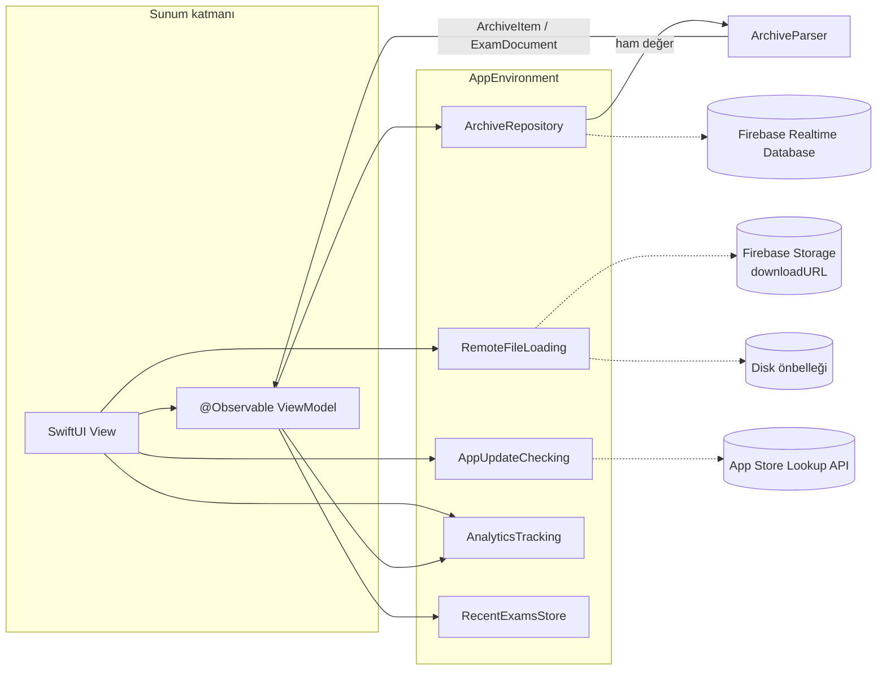

<div align="center">


# ViFi — Sınav Arşivi

Üniversitelerin geçmiş sınavlarına hızlıca ulaşmanı sağlayan iOS uygulaması.


</div>

---

## İçindekiler

- [Hakkında](#hakkında)
- [Özellikler](#özellikler)
- [Ekran Görüntüleri](#ekran-görüntüleri)
- [Mimari](#mimari)
- [Klasör Yapısı](#klasör-yapısı)
- [Gereksinimler](#gereksinimler)
- [Kurulum](#kurulum)
- [Örnek Veriyle Çalıştırma](#örnek-veriyle-çalıştırma)
- [Testler ve Kod Kalitesi](#testler-ve-kod-kalitesi)
- [Sürüm Notları](#sürüm-notları)
- [Bilinen Durumlar](#bilinen-durumlar)

## Hakkında

**ViFi**, öğrencilerin üniversitelerine ait geçmiş dönem sınavlarını tek bir yerden bulup incelemesi için
geliştirilmiş bir sınav arşividir. Arşiv beş seviyeden oluşur:

```
Üniversite › Fakülte › Bölüm › Ders › Sınav
```

Her sınav ya sayfa sayfa görsellerden (JPG) ya da bir PDF belgesinden oluşur. Arşiv Firebase Realtime Database'te,
sınav dosyaları ise Firebase Storage'da tutulur.

## Özellikler

| Özellik | Açıklama |
|---|---|
| **Hiyerarşik gezinme** | Üniversiteden sınava kadar tek bir gezinme yığını; üstteki içerik yolu (breadcrumb) ile herhangi bir üst seviyeye tek dokunuşla dön. |
| **Arama** | Her listede Türkçe karakter ve büyük/küçük harf duyarsız arama (`ı/i`, `ş/s`, `ğ/g`…). |
| **Son görüntülenenler** | Ana sayfada son açılan sınavlar; tek dokunuşla tekrar aç, listeden kaldır ya da tümünü temizle. |
| **Görsel sınav görüntüleyici** | Sayfa kartları, tam ekran sayfalayıcı, 1–5x yakınlaştırma, çift dokunarak yakınlaştır/sıfırla. |
| **Uygulama içi PDF** | PDFKit ile sürekli kaydırma, sayfa göstergesi ve birden fazla dosya arasında geçiş. |
| **Paylaşım** | Sınavın tamamını ya da tek bir sayfayı dosya olarak paylaş. |
| **Çevrimdışı önbellek** | Açılan sınav dosyaları cihazda saklanır; daha önce açılan sınavlar tekrar indirilmeden açılır. |
| **Karanlık mod** | Tüm ekranlar sistem renkleriyle açık ve koyu temaya uyum sağlar. |
| **Erişilebilirlik** | Dynamic Type, VoiceOver etiketleri ve iPad'de okunabilir satır genişlikleri. |
| **Güncelleme bildirimi** | App Store'da yeni sürüm olduğunda kullanıcı nazikçe bilgilendirilir. |
| **Gizlilik** | Reklam yok, reklam kimliği (IDFA) yok, takip izni istenmez. |

## Ekran Görüntüleri

<!--
Ekran görüntülerini örnek veriyle (-ViFiMockData) alıp docs/screenshots/ altına ekleyin ve aşağıdaki
tabloyu  biçimindeki etiketlerle güncelleyin.
Açık ve koyu tema için ayrı görüntüler önerilir.
-->

| Ana Sayfa | Gezinme | Görsel Sınav | PDF |
|:---:|:---:|:---:|:---:|
| _yakında_ | _yakında_ | _yakında_ | _yakında_ |

## Mimari

ViFi; **SwiftUI**, **MVVM** ve **Observation** çatısı üzerine kurulu, Swift 6 katı eşzamanlılık
(strict concurrency) modunda derlenen bir uygulamadır.



### Temel kararlar

- **SwiftUI + MVVM + Observation.** Ekran durumları `@Observable` view model'lerde tutulur ve view tarafından
  `@State` ile sahiplenilir. Combine ve `ObservableObject` kullanılmaz; asenkron işler `async/await` ile yürür.
- **Swift 6 ve MainActor varsayılanı.** Proje `SWIFT_DEFAULT_ACTOR_ISOLATION = MainActor` ile derlenir; görsel
  çözme, dosya ve JSON işlemleri gibi ağır işler `nonisolated` fonksiyonlarla ana iş parçacığının dışında yapılır.
- **Protokol arkasındaki servisler.** Veri katmanı `ArchiveRepository`, `RemoteFileLoading`, `AppUpdateChecking`
  ve `AnalyticsTracking` protokolleri üzerinden kullanılır. Böylece Firebase, App Store ve ağ erişimi testlerde ve
  önizlemelerde örnek implementasyonlarla değiştirilebilir.

  | Protokol | Canlı implementasyon | Örnek (DEBUG) implementasyon |
  |---|---|---|
  | `ArchiveRepository` | `FirebaseArchiveRepository` | `MockArchiveRepository` |
  | `RemoteFileLoading` | `RemoteFileLoader` | `RemoteFileLoader` (paket içi örnek dosyalar) |
  | `AppUpdateChecking` | `AppStoreUpdateChecker` | `StubUpdateChecker` |
  | `AnalyticsTracking` | `FirebaseAnalyticsTracker` | `NoOpAnalyticsTracker` |

- **AppEnvironment ile bağımlılık enjeksiyonu.** Tüm servisler tek bir `AppEnvironment` nesnesinde toplanır ve
  `.environment(_:)` ile view hiyerarşisine verilir. `live()` üretim servislerini, `mock()` örnek veriyi kurar;
  `makeDefault()` başlatma argümanına göre ikisinden birini seçer.
- **Router.** Gezinme durumu `NavigationStack` yolunu tutan `@Observable Router` nesnesindedir. `Route` enum'u
  (`browse`, `exam`) tüm hedefleri tanımlar; breadcrumb'a dokunmak `popTo(_:)`, son görüntülenen bir sınavı açmak
  ise `openExam(at:kind:)` ile tüm üst seviyeleri yığına yerleştirir, böylece Geri tuşu arşivde yukarı yürür.
- **ArchiveParser.** Realtime Database'ten gelen ham değerleri modellere çeviren, Firebase'e bağımlı olmayan saf bir
  katmandır. İsim yer tutucularını (`uniname`, `fakname`…) atlar, dizi biçimindeki düğümleri normalize eder ve
  listeleri Türkçe harf sıralaması ile sayı farkındalıklı sıralar (sınavlar en yeniden eskiye).
- **Çevrimdışı önbellek.** `RemoteFileLoader` dosyaları geniş bir `URLCache` ve `Caches/ExamFiles` altındaki disk
  önbelleği ile indirir; görseller ekran boyutuna göre küçültülerek çözülür.
- **Durum ve günlük.** Ekran içerikleri `Loadable` (`loading` / `loaded` / `failed`) ile modellenir; hatalar
  `ArchiveError` üzerinden kullanıcıya Türkçe mesajlarla gösterilir. Günlükler `print` yerine OSLog
  (`Logger.archive`, `Logger.files`, `Logger.app`) ile yazılır.

### Veritabanı yapısı

```
Universitiess/<üniversite>/<fakülte>/<bölüm>/<ders>/<sınav>/<JPG|PDF>/<pushId>/downloadURL
```

Her düğüm kendi adını da metin değeri olarak saklar (`uniname`, `fakname`, `bolname`, `lessonname`, `imagename`);
gerçek arşiv düğümleri her zaman nesne olduğundan bu yaprak değerler listelenmez.

## Klasör Yapısı

```
ViFi-iOS/
├── project.yml              # XcodeGen tanımı — Xcode projesinin tek kaynağı
├── .swiftlint.yml           # Lint kuralları
├── ViFi/
│   ├── App/                 # Uygulama girişi, RootView, Router, AppEnvironment
│   ├── Core/
│   │   ├── Models/          # ArchivePath, ArchiveItem, ExamDocument
│   │   ├── Services/        # Servis protokolleri, ArchiveParser, Firebase / App Store servisleri, RecentExamsStore
│   │   └── Utilities/       # Loadable, Logger
│   ├── DesignSystem/        # IconBadge, durum görünümleri, seviye stilleri
│   ├── Features/
│   │   ├── Home/            # Ana sayfa, son görüntülenenler, Hakkında
│   │   ├── Browse/          # Fakülte → sınav listeleri, breadcrumb
│   │   └── Exam/            # Görsel ve PDF sınav görüntüleyicileri
│   ├── Resources/           # Assets, Info.plist, GoogleService-Info.plist
│   └── Preview Content/     # Önizleme ve örnek veri dosyaları (yalnızca geliştirme)
├── ViFiTests/               # Birim testleri
└── ViFiUITests/             # Arayüz testleri (örnek veriyle çalışır)
```

> **Not:** 2.x sürümünün UIKit/Storyboard kaynakları, `Podfile` ve `ViFi.xcworkspace` 3.0 ile kaldırıldı; git
> geçmişinde duruyorlar. Projeyi her zaman `ViFi.xcodeproj` ile açın, `pod install` çalıştırmayın.

## Gereksinimler

| Araç | Sürüm |
|---|---|
| Xcode | 26 veya üzeri |
| iOS / iPadOS | 17.0 veya üzeri |
| [XcodeGen](https://github.com/yonaskolb/XcodeGen) | 2.42 veya üzeri |
| [SwiftLint](https://github.com/realm/SwiftLint) | Önerilir (derleme sırasında çalışır) |

Bağımlılıklar Swift Package Manager ile yönetilir: Firebase iOS SDK 12 (`FirebaseDatabase`,
`FirebaseAnalyticsCore`). CocoaPods kullanılmaz. Paket sürümleri depodaki `Package.resolved` ile sabitlenir
(Firebase 12.19.2); güncellemek için Xcode'da *File › Packages › Update to Latest Package Versions*.

## Kurulum

```bash
# 1. Araçları kur
brew install xcodegen swiftlint

# 2. Depoyu klonla
git clone https://github.com/emrebuyuker/ViFiIos.git ViFi-iOS
cd ViFi-iOS

# 3. Xcode projesini üret
xcodegen generate

# 4. Projeyi aç (paketler ilk açılışta çözülür)
open ViFi.xcodeproj
```

- **Proje dosyası üretilir.** `ViFi.xcodeproj` XcodeGen tarafından `project.yml`'dan oluşturulur ve depoda tutulmaz
  (yalnızca SwiftPM kilit dosyası `Package.resolved` saklanır). Hedef, ayar ya da bağımlılık değişikliklerini
  `project.yml` üzerinde yapıp `xcodegen generate` komutunu tekrar çalıştırın.
- **GoogleService-Info.plist.** Canlı Firebase yapılandırması `ViFi/Resources/GoogleService-Info.plist` dosyasındadır.
  Kendi Firebase projenizle çalışacaksanız bu dosyayı kendi projenizin dosyasıyla değiştirin. Örnek veri modu
  Firebase'e hiç bağlanmaz ve bu dosyaya ihtiyaç duymaz.
- **İmzalama.** Simülatör derlemeleri imza gerektirmez. Gerçek cihazda çalıştırmak için `project.yml` içindeki
  `DEVELOPMENT_TEAM` ve provisioning profili ayarlarını kendi hesabınıza göre güncelleyin.

## Örnek Veriyle Çalıştırma

Uygulama, Firebase'e ve ağa hiç dokunmadan paket içindeki örnek arşivle çalışabilir. Bu mod UI testleri, demolar ve
Firebase erişimi olmayan geliştirme ortamları içindir ve yalnızca **Debug** derlemelerinde bulunur.

**Xcode'da:** *Product › Scheme › Edit Scheme… › Run › Arguments* altında *Arguments Passed On Launch* listesine
`-ViFiMockData` ekleyin.

**Komut satırında:**

```bash
# Derle (çıktı ./build altına)
xcodebuild -project ViFi.xcodeproj -scheme ViFi \
  -destination 'platform=iOS Simulator,name=iPhone 17 Pro' -derivedDataPath build build

# Simülatörü aç (zaten açıksa hata verir; yok sayılabilir), uygulamayı kur ve örnek veriyle başlat
xcrun simctl boot 'iPhone 17 Pro'
xcrun simctl install booted build/Build/Products/Debug-iphonesimulator/ViFi.app
xcrun simctl launch booted com.BuyukerYazilim.ViFi2 -ViFiMockData
```

Örnek arşiv; görsel ve PDF sınavlar, uzun isimli bir üniversite, sınavı olmayan bir ders ve dosyası olmayan bir
sınav gibi uç durumları içerir. SwiftUI önizlemeleri de aynı veriyi `AppEnvironment.mock()` üzerinden kullanır.

## Testler ve Kod Kalitesi

```bash
# Birim ve arayüz testleri (kod kapsamı açık)
xcodebuild test -project ViFi.xcodeproj -scheme ViFi \
  -destination 'platform=iOS Simulator,name=iPhone 17 Pro'

# Lint ve otomatik düzeltme
swiftlint lint
swiftlint --fix
```

- **ViFiTests** — `ArchiveParser`, view model'ler, sürüm karşılaştırması ve son görüntülenenler gibi iş mantığını
  ağdan bağımsız olarak doğrular.
- **ViFiUITests** — Uygulamayı `-ViFiMockData` ile başlatır ve ana akışları (gezinme, arama, sınav açma, son
  görüntülenenler) uçtan uca test eder. Testler erişilebilirlik kimliklerine (`home.list`, `row.<ad>`,
  `breadcrumb.<i>`, `exam.images`…) dayanır; bu kimlikler testlerle yapılan bir sözleşmedir, değiştirilmemelidir.
- **SwiftLint** her derlemede çalışır. `print` yerine `Logger`, Combine yerine Observation kullanımı gibi proje
  kuralları da lint ile denetlenir.

## Sürüm Notları

### 3.0.0

2.x sürümüne göre uygulama baştan yazıldı.

**Yeni**

- Karanlık mod desteği.
- Tüm listelerde Türkçe karakter duyarsız arama.
- Ana sayfada son görüntülenen sınavlar.
- PDF sınavlar artık Safari yerine uygulama içinde, PDFKit ile sayfa göstergesiyle açılıyor.
- Yakınlaştırma, çift dokunma ve sayfa paylaşımı destekleyen yeni tam ekran görüntüleyici.
- Sınavların tamamını dosya olarak paylaşma.
- Açılan sınavlar için çevrimdışı önbellek.
- Yeni sürüm bildirimi.
- Dynamic Type, VoiceOver ve iPad için iyileştirilmiş erişilebilirlik.

**Değişen**

- UIKit / Storyboard tabanlı uygulama SwiftUI ile yeniden yazıldı (MVVM + Observation, Swift 6).
- Sekme çubuğuyla gezinme yerine tek gezinme yığını ve breadcrumb kullanılıyor.
- CocoaPods yerine Swift Package Manager; Xcode projesi XcodeGen ile üretiliyor.
- Firebase 10'dan 12'ye güncellendi; yalnızca `FirebaseDatabase` ve `FirebaseAnalyticsCore` kullanılıyor.
- Dosyalar Firebase Storage SDK'sı yerine `downloadURL` üzerinden `URLSession` ile indiriliyor.
- Minimum sürüm iOS 14'ten iOS 17'ye yükseltildi.

**Kaldırılan**

- Reklamlar, reklam kimliği (IDFA) ve takip izni.
- Kullanılmayan bağımlılıklar: Alamofire, SDWebImage, Firebase Messaging ve Firebase Storage SDK'sı.

**Düzeltilen**

- Listeler yenilenirken eski bir satıra dokunulduğunda oluşan çökmeler.
- iPad'de üst seviye seçilmeden bir sekme açıldığında oluşan çökme.
- Görsel sınava geri dönüldüğünde sayfaların çoğalması.

## Bilinen Durumlar

> [!WARNING]
> **Firebase Storage — HTTP 402.** Firebase projesi ücretsiz **Spark** planındayken `appspot.com` uzantılı Storage
> bucket'larına yapılan dosya istekleri `HTTP 402 Payment Required` ile reddedilir. Bu durumda listeler normal
> yüklenir ancak sınav dosyaları açılamaz ve kullanıcıya *"Dosya şu anda sunucudan alınamıyor"* mesajı gösterilir
> (`ArchiveError.fileUnavailable`). Sorun uygulamadan kaynaklanmaz; Firebase projesi **Blaze** (kullandıkça öde)
> planına geçirildiğinde dosyalar kod değişikliği gerekmeden yeniden açılır.
